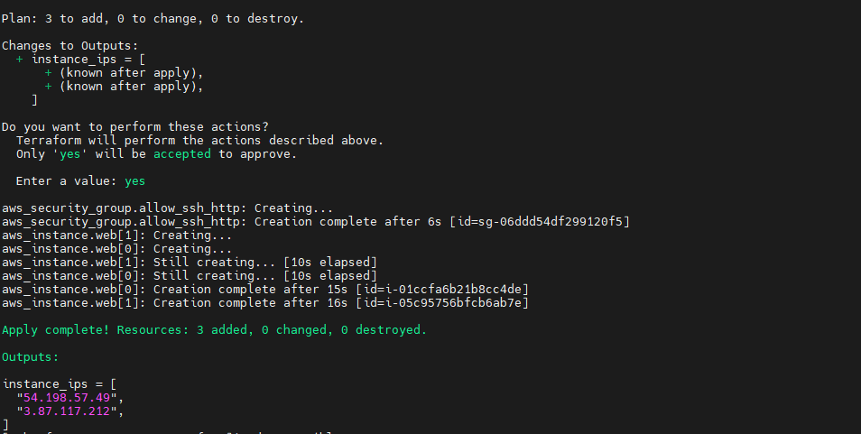
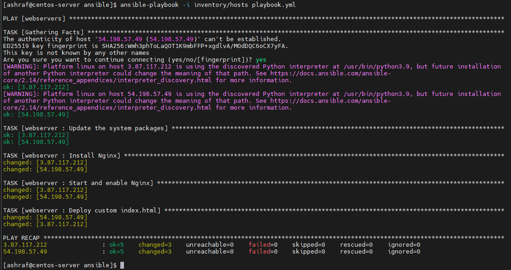
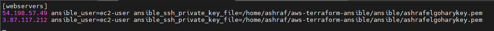
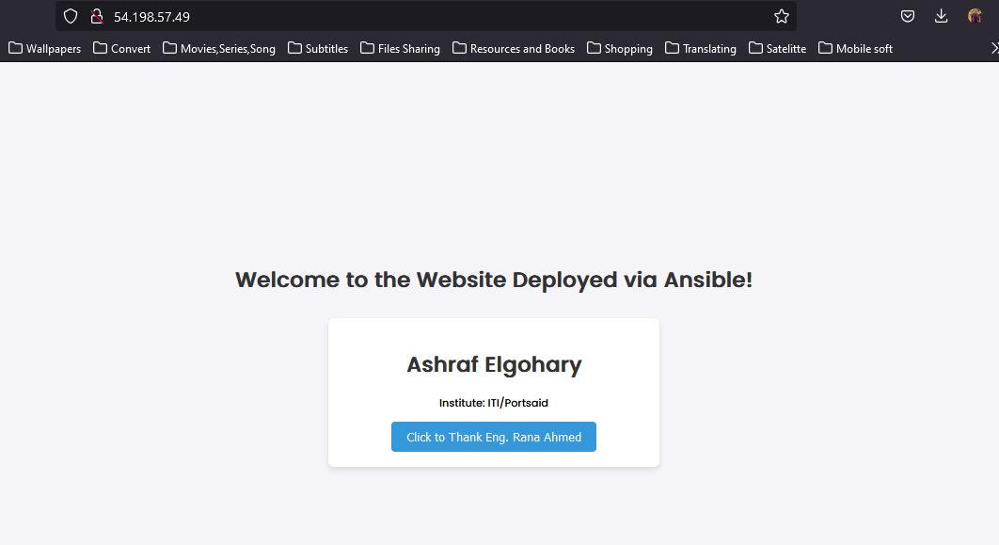
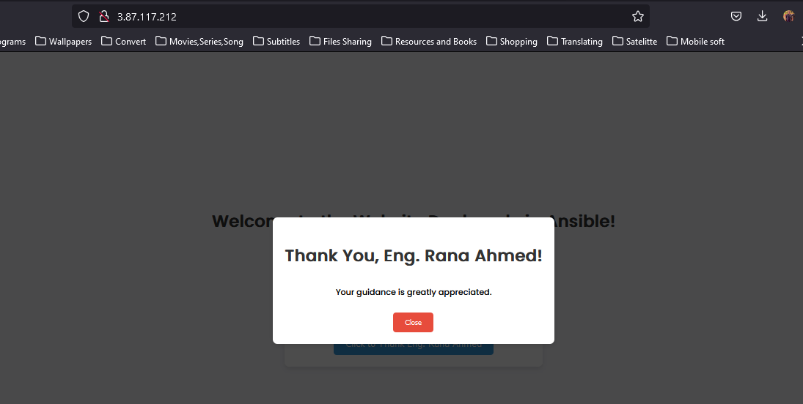

# Ansible Terraform Deploy

## Overview
The **Ansible Terraform Deploy** project is designed to automate the deployment of infrastructure and application configurations using Ansible and Terraform. This project leverages the power of Infrastructure as Code (IaC) to provision cloud resources efficiently, ensuring consistency and repeatability in deployments.

## Key Features
- **Infrastructure Provisioning:** Utilize Terraform to define and provision infrastructure resources, such as virtual machines, networks, and storage, on cloud platforms like AWS.
  
- **Configuration Management:** Implement Ansible for application deployment and configuration management, ensuring that applications are correctly set up and running as intended.

- **Modular Design:** The project is structured in a modular way, allowing easy modifications and scalability. Users can add or remove components as needed without affecting the overall architecture.

- **Version Control:** The project is hosted on GitHub, enabling version control and collaboration among team members.

- **Documentation:** Comprehensive documentation is provided, including setup instructions, usage guidelines, and examples to help users get started quickly.

## Technologies Used
- **Terraform** for Infrastructure as Code
- **Ansible** for Configuration Management
- **GitHub** for version control


##Terrraform Deploy



##Ansible Deployment



##EC2 Instances



##Webservers






## Getting Started
To get started with the Ansible Terraform Deploy project, clone the repository and follow the setup instructions provided in the documentation.

```bash
git clone https://github.com/ashrafelgohary/Ansible-Terraform-Deploy.git
cd Ansible-Terraform-Deploy
